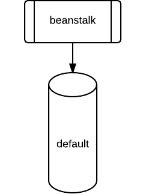
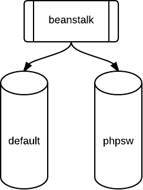
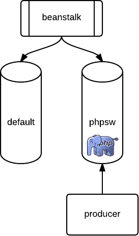
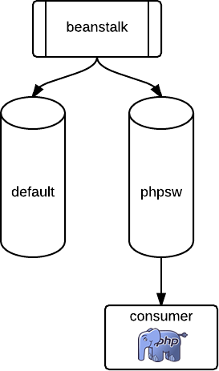
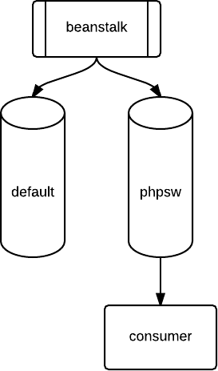
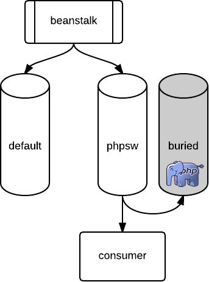
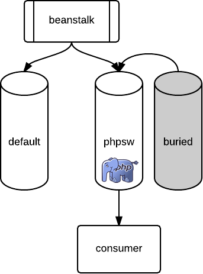

class: center, middle

background-image: url(images/crowd.jpg)


# Beanstalk & Supervisord

---
class: center, middle
background-image: url(images/beanstalk.jpg)

#Beanstalk

---
#Beanstalk

* Simple job queue

???

Job queue or work queue

Job is just a blob of data, you can store binary, yaml, strings

we use json as lets you store a job name and parameters, then read it in admin tools

Tubes are separate storage areas

binary logging for recovery

just use several servers and switch between

--

* Jobs are blobs
    * We use JSON

--

* Stored in tubes

    * No configuration needed

--

* Binary logging

* Memcache style distribution
    * Client handles connections to several servers

---
.fleft[

]

.fright[
```php
$bean = new Pheanstalk('127.0.0.1');
```
]

???

How does it work - simple example 

Fire up pheanstalk and connect to the server. There is always a tube called "default"

PHP Examples use Pheanstalk library

---
.fleft[

]

.fright[
```php
$bean = new Pheanstalk('127.0.0.1');
$bean->useTube("phpsw");
```
]

???

Tubes are created on demand

Here we have connected as someone who will produce jobs

beanstalk has created the tube automatically

---
.fleft[

]

.fright[
```php
$bean = new Pheanstalk('127.0.0.1');
$bean->useTube("phpsw");
$bean->put("count the elephpants")
```
]

???
Created our job, data is send from our client and stored in the tube

we can disconnect and beanstalk will keep the tube around as it has data

---
.fleft[

]

.fright[
```php
$bean = new Pheanstalk('127.0.0.1');
$bean->watch("phpsw");
$job = $bean->reserve();
```
]

???
Connected as a consumer

Reserve call is blocking, so we can wait until something arrives

Reserve gives us the body of the job, so we can read it and process it as we see fit

---
.fleft[

]

.fright[
```php
$bean = new Pheanstalk('127.0.0.1');
$bean->watch("phpsw");
$job = $bean->reserve();
$bean->delete($job);
```
]

???
Job has been done successfully

delete it so no others pick it up

---
.fleft[

]

.fright[
```php
$bean = new Pheanstalk('127.0.0.1');
$bean->watch("phpsw");
$job = $bean->reserve();
//turns out I can't count elephpants
$bean->bury($job);
```
]

???
Lets say we can't handle the job - can't parse it or throw an exception

bury puts it in a second queue that won't automatically be sent out

Lets us inspect the job and the code without it running around

---
.fleft[

]

.fright[
```php
$bean = new Pheanstalk('127.0.0.1');
$bean->watch("phpsw");
$bean->kick(1);
```
]

???
Once it's resolved we kick the job, which puts it back in the queue

---
#What can we use it for?
--

###Expensive Tasks
* Image Processing
    * Scaling
    * Filtering
    * Uploading

???
We have multiple sizes needed

run face detection

upload to s3 - takes time

Dont want to block up a browser & apache thread doing this

network / memory breaks - job will be buried, restart
--
###Distributed Tasks
* Updates system

???
Lots of different systems that make changes to data

Lots of systems that are interested in changes

Job goes in queue, updates search, api, cache
--

###Scale
* Email sender

???
Single threaded email sender takes 8 hours for newsletter

can put a job in for each user, or block of users

Multiple workers mean multithreading

---
class: center, middle
background-image: url(images/supervisord.jpg)

#Supervisord

???

Php on its own makes this hard

dont want to have to start each one in a terminal

---
#Supervisord

* Manages long running processes

   * Starts
   * Restarts
   * Stops
   * Logs

???

Starts for us when it starts

restarts when we ask

stops when we ask, or if they keep crashing

logs output for us to view

--

* You control how many via a config file
```
[program:myworker]
command=php /var/www/worker.php
numprocs=10
[program:specialworker]
command=php /var/www/something-else.php --do-magic
numprocs=1
```

???

two workers, each with own script and number of workers

---
#Supervisord Management

Manage everything via `supervisorctl`

```
dougf@media1$supervisorctl
mediaworkers:mediaworker_00      RUNNING    pid 25243, uptime 0:40:14
mediaworkers:mediaworker_01      RUNNING    pid 25242, uptime 0:40:15
supervisor>
```

???

useful little command line tool

shows us an overview of everything

--

```
supervisor> stop all
supervisor> start all
supervisor> tail mediaworkers:mediaworker_00
//Oh, the aim of our patrol
//Is a question rather droll
//For to march and drill
//Over field and hill
//Is a military goal
```

???

how we stop and start them

tail lets us view last few lines of stdout

---

#Problems - MySQL

```
PDOException with message
'SQLSTATE[HY000]: General error: 2006 MySQL server has gone away'
```

???

biggest problem! php libs arent good at long running connections

if youre blocked waiting for a job overnight, connections have failed when the first one arrives in the morning

--

* mysqli is good (`mysqli.reconnect`)

???

mysqli has config setting that reconnets on failure

I havent tried this

--

* PDO is bad
   * One catch block for the PDO object
   * One catch block for the PDOStatement object
   * *Still* triggers a warning

???

throws exception, which is good

but hard to catch and handle properly

have to rebuild statements on error

--

```
Warning: PDO::query() [pdo.query]: MySQL server has gone away
```

---

#Problems - Swiftmailer

```
Expected response code 250 but got code "421"
```

???

same thing from an SMTP server - you were away too long

--

* Catchable as `Swift_TransportException`

--

```
$transport->stop()
```
* Swiftmailer will automatically reconnect

---
#Problems - Swiftmailer

```
fwrite(): send of 41 bytes failed with errno=32
Broken pipe in Swift/Transport/StreamBuffer.php on line 236
```

* PHP Notice - uncatchable
* "Just reconnect each time!"
    * Not a great solution...
--
* If in doubt exit and let supervisord restart you

???

Sometimes you get this instead

Can't be caught easily

solution from maintainers is to restart often

---
#Summary

Beanstalk [http://kr.github.io/beanstalkd/]():

* Easy to set up and understand
* Helps you scale and break apart complicated tasks

Supervisor [http://supervisord.org/]():

* Essential for managing multiple long-running PHP processes
* Makes crash handling easy

PHP

* Lots of libraries are iffy about holding connections open
* Most issues are solvable with Exceptions

---
class: center, middle

#Questions?